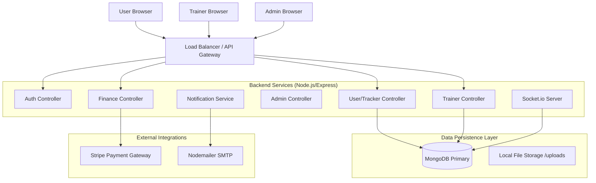

# 🏋️ Fitness Tracker Management System - System Design Document

**Version:** 1.0.0 released
**Date:** January 17, 2026
**Author:** Mohammed Ansari
**Tech Stack:** MERN (MongoDB, Express, React, Node.js)

---

## 1. Executive Summary

The **Fitness Tracker Management System** is an enterprise-grade web platform designed to digitize the personal training industry. It provides a seamless ecosystem for three distinct user roles: **Clients** (seeking health improvement), **Trainers** (managing fitness businesses), and **Administrators** (overseeing platform operations).

Unlike standard fitness apps, this platform integrates **AI-driven coaching**, **Real-time Communication**, **Financial Management**, and **Gamification** into a single, cohesive architecture.

---

## 2. System Architecture

The application implements a **Service-Oriented Architecture (SOA)** within a Monorepo structure, ensuring separation of concerns while maintaining a unified codebase.

### 2.1 High-Level Design


---

## 3. Data Models (Database Schema)

The database is built on **MongoDB**, utilizing **Mongoose** for object modeling. Key collections include:

### 3.1 Core Users
*   **Users**: Stores Client profile, biometric data (height, weight, age), goals, and active subscription status.
*   **Trainers**: Stores professional details, specializations, earnings, and assigned clients.
*   **Admins**: Super-user accounts with system-wide access.

### 3.2 Fitness Data
*   **Workouts**: Daily exercise logs with sets, reps, and weights.
*   **Exercises**: Global library of exercises (e.g., "Bench Press") with video URLs and muscle groups.
*   **Diets**: Nutrition logs tracking calories, protein, carbs, and fats.
*   **Sleep/Water**: Daily vital logs.

### 3.3 Business & Operations
*   **Sessions**: Calendar appointments for PT sessions (In-Person/Video), linked to Trainers and Users.
*   **Payouts**: Trainer withdrawal requests and status (Pending/Processed).
*   **Reviews**: Client feedback ratings (1-5 stars) and comments.
*   **Notifications**: System alerts for sessions, payments, and reminders.

---

## 4. Comprehensive Feature Specification

### 4.1 Client Portal Features
The Client Portal is the user-facing application focused on engagement and tracking.
*   **Dashboard Widget**: A consolidated view of "Today's Progress" (Calories, Water, Sleep) and "Upcoming Sessions".
*   **AI Coach**: An intelligent rule-based engine that generates weekly workout plans based on the user's specific injuries (e.g., "Avoid Knees") and equipment availability.
*   **Adaptive Training**: The "Log Workout" feature asks user feedback ("Too Easy", "Too Hard") and automatically adjusts weights for the next session.
*   **Gamification**: Users earn "Badges" (e.g., "Early Bird", "Hydration Hero") and maintain "Streaks" for daily logins.
*   **Wearable Hub**: A simulation interface to connect mock devices (Fitbit, Apple Watch) and sync step counts.
*   **Premium Upgrades**: Integrated **Stripe Checkout** allows users to upgrade to "Pro" tiers for advanced analytics.

### 4.2 Trainer Portal Features
The Trainer Portal is a CRM (Customer Relationship Management) tool for fitness professionals.
*   **Client 360 View**: Trainers can see a client's full history, including missed workouts and dietary adherence.
*   **Program Builder**: A drag-and-drop style interface to build complex weekly schedules, explicitly marking "Rest Days" and "Active Recovery".
*   **Calendar & Scheduling**: A full booking system where trainers define availability, and clients (or trainers) book slots.
*   **Financial Dashboard**:
    *   **Revenue Charts**: Visual breakdown of monthly income.
    *   **Transaction History**: Detailed log of every client payment.
    *   **Payout Request**: Automated system to request bank transfers.
*   **PDF Exports**: One-click generation of client progress reports for offline sharing.

### 4.3 Admin Portal Features
The Admin Portal is the control center for system health and safety.
*   **User Management**: Ability to "Block" or "Suspend" abusive Users or Trainers.
*   **Content Moderation**: Review and approve public exercise submissions or community posts.
*   **Global Push Notifications**: Send system-wide alerts (e.g., "Maintenance at 2 AM") to all users relative to their role.
*   **Support Ticket System**: A helpdesk interface to resolve user inquiries.

---

## 5. API Documentation (Key Endpoints)

### 5.1 Authentication (`/api/auth`)
*   `POST /register`: Register a new Client.
*   `POST /login`: Authenticate and receive a JWT.
*   `POST /trainer/register`: Register a new Trainer application.

### 5.2 Fitness Tracker (`/api/tracker`)
*   `GET /dashboard`: Aggregate daily stats.
*   `POST /workouts`: Log a completed workout session.
*   `GET /history`: Retrieve past logs for charts.

### 5.3 Finance & Commerce (`/api/finance`)
*   `GET /stats`: (Trainer Only) View total earnings and active subscribers.
*   `POST /request-payout`: (Trainer Only) Initiate a fund withdrawal.
*   `POST /webhook`: Stripe webhook handler for payment success events.

### 5.4 Social & Reviews (`/api/reviews`)
*   `POST /`: (Client Only) Submit a star rating for a Trainer.
*   `GET /my-reviews`: (Trainer Only) Fetch all received feedback.

---

## 6. Installation & Configuration Guide

### 6.1 Prerequisites
Ensure your development environment meets the following requirements:
*   **Node.js**: v18.0.0 or higher.
*   **MongoDB**: v6.0+ (Local Community Edition or Atlas Cloud).
*   **Stripe Account**: For testing payments in "Test Mode".

### 6.2 Environment Variables (.env)
Create a `.env` file in the `backend/` directory with the following keys:

| Variable | Description | Example Value |
| :--- | :--- | :--- |
| `PORT` | API Server Port | `5000` |
| `MONGO_URI` | Database Connection String | `mongodb://localhost:27017/fitness_db` |
| `JWT_SECRET` | Secret for signing Tokens | `my_super_secret_key_123` |
| `STRIPE_SECRET_KEY` | Stripe Secret Key (sk_test_...) | `sk_test_51Mz...` |
| `EMAIL_USER` | SMTP Username | `admin@fitness.com` |
| `EMAIL_PASS` | SMTP Password | `app_specific_password` |

### 6.3 Deployment Steps (Local)
1.  **Clone the Repository**:
    ```bash
    git clone https://github.com/your-repo/fitness-tracker.git
    cd fitness-tracker
    ```

2.  **Install & Run Backend**:
    ```bash
    cd backend
    npm install
    npm run dev
    ```
    *Server will start at `https://fitness-tracker-management-system-xi0y.onrender.com`*

3.  **Install & Run Frontends**:
    *   **User App**:
        ```bash
        cd frontend-user
        npm install
        npm run dev
        ```
    *   **Trainer App**:
        ```bash
        cd frontend-trainer
        (repeat install & dev)
        ```
    *   **Admin App**:
        ```bash
        cd frontend-admin
        (repeat install & dev)
        ```

---

## 7. Troubleshooting & FAQ

**Q: I get a "MongoDB connection error".**
A: Ensure your MongoDB service is running locally (`mongod`), or check if your IP is whitelisted in MongoDB Atlas.

**Q: Images are not loading.**
A: The system uses local file storage. Ensure the `/uploads` directory exists in the `backend` folder and contains the necessary assets.

**Q: Stripe payments fail.**
A: Verify you are using valid "Test Cards" (e.g., 4242 4242...) and that your `STRIPE_SECRET_KEY` is correct in the `.env` file.

---

## 8. License & Copyright
This project is licensed under the **ISC License**. Use, modification, and distribution are permitted.

**© 2026 Developed by Mohammed Ansari.**
