# 🏋️ Fitness Tracker Management System - System Documentation

**Version:** 1.0.0
**Status:** In Development
**License:** ISC

---

## 📖 Table of Contents
1.  [Project Overview](#-project-overview)
2.  [System Architecture](#-system-architecture)
3.  [Core Features](#-core-features)
4.  [Technology Stack](#-technology-stack)
5.  [Installation & Setup Guide](#-installation--setup-guide)
6.  [Directory Structure](#-directory-structure)
7.  [API Documentation Overview](#-api-documentation-overview)
8.  [Contribution Guidelines](#-contribution-guidelines)

---

## 🚀 Project Overview

The **Fitness Tracker Management System** is a robust, full-stack web application designed to bridge the gap between personal fitness tracking and administrative management. It serves two distinct user groups:
1.  **Fitness Enthusiasts**: Individuals who want to track their workouts, diet, hydration, sleep, and physical progress.
2.  **Administrators/Trainers**: System managers who curate exercise content, manage nutritional databases, oversee user challenges, and monitor system usage.

This project utilizes the **MERN Stack** (MongoDB, Express.js, React.js, Node.js) to deliver a seamless, responsive, and real-time experience.

---

## 🏗 System Architecture

The application follows a modern **Monorepo-style** architecture, separating concerns between three distinct React frontends and a centralized Node.js/Express backend.

### System Diagram

```mermaid
graph TD
    subgraph Clients
        UserUI["👤 User Portal<br/>(React + Vite)"]
        TrainerUI["🏋️‍♂️ Trainer Portal<br/>(React + Vite)"]
        AdminUI["🛡️ Admin Portal<br/>(React + Vite)"]
    end

    subgraph Server_Layer
        LB["API Gateway / Server<br/>(Express.js)"]
        Auth["🔐 Auth Service<br/>(JWT + Bcrypt)"]
        Logic["🧠 Business Logic<br/>(Controllers)"]
    end

    subgraph Data_Layer
        DB[("🍃 MongoDB")]
        Storage["📂 Local Storage<br/>(Images/Uploads)"]
    end

    UserUI -- HTTP/JSON --> LB
    TrainerUI -- HTTP/JSON --> LB
    AdminUI -- HTTP/JSON --> LB

    LB --> Auth
    LB --> Logic
    Logic --> DB
    Logic --> Storage
```



### High-Level Components
*   **Client Layer**: Three separate Single Page Applications (SPAs) tailored for specific roles.
*   **Service Layer**: A RESTful Express server handling routing, validation, and authorization.
*   **Data Layer**: MongoDB for persistent data and local filesystem for media storage.

---

## ✨ Core Features

### 👤 User Portal (Frontend-User)
Designed for motivation and ease of use.
*   **Dashboard**: A summary view of daily logging status (Calories, Water, Sleep) and recent activity.
*   **Workout Tracker**:
    *   Custom Workout Logging (Sets, Reps, Weight).
    *   Duration Timer.
    *   Access to Global Exercise Library.
*   **Nutrition Manager**:
    *   Search Food Database.
    *   Log meals (Breakfast, Lunch, Dinner, Snacks).
    *   Calorie & Macro tracking.
*   **Vital Tracking**:
    *   **Hydration**: Tap to log water glasses.
    *   **Sleep**: Log sleep duration and quality.
    *   **Weight**: Track body weight changes with history.
*   **Social Hub**:
    *   **Community Feed**: See friends' activities.
    *   **Leaderboards**: Compete on XP and achievements.
    *   **Direct Messaging**: Real-time chat with Trainers.
*   **Analytics & Gamification**:
    *   **Badges**: Earn rewards for consistency.
    *   **PR Tracking**: Monitor Personal Records.
    *   **1RM Calculator**: Estimate max strength.

### 🏋️‍♂️ Trainer Portal (Frontend-Trainer)
Designed for coaching and client management.
*   **Client Management**: List of assigned clients with quick stats.
*   **Program Builder**: Create and assign custom Workout and Diet plans.
*   **Chat System**: Direct communication with clients.
*   **Content Creation**: Add custom exercises and templates.

### 🛡️ Admin Portal (Frontend-Admin)
Designed for content curation and user oversight.
*   **System Dashboard**: Global counts of users, workouts logged, and system health.
*   **Content Management Systems (CMS)**:
    *   **Exercise Library**: Add/Update/Delete standard exercises (e.g., "Bench Press", "Squat").
    *   **Food Database**: Manage nutritional info for common foods.
    *   **Workout Templates**: Create "Day 1" or "Full Body" templates for users.
*   **User Management**: View user list, detailed profiles, and activity logs.
*   **Challenge Management**: Create, Edit, and Delete system-wide challenges.

---

## 🛠 Technology Stack

### Backend
*   **Runtime**: Node.js (v18+)
*   **Framework**: Express.js
*   **Database**: MongoDB (Mongoose ODM)
*   **Authentication**: JSON Web Tokens (JWT), bcryptjs
*   **Middleware**: CORS, Dotenv, Multer (File Uploads)

### Frontend (User & Admin)
*   **Library**: React.js (v18)
*   **Build Tool**: Vite
*   **Styling**: Tailwind CSS
*   **Icons**: Lucide React
*   **HTTP Client**: Axios
*   **Routing**: React Router DOM (v6)

---

## 📂 Directory Structure

A high-level view of the project workspace:

```bash
Fitness Tracker Management System/
├── backend/                  # 🟢 Node.js API Server
│   ├── config/               # DB & Env Configurations
│   ├── controllers/          # Route Logic (Auth, Tracker, etc.)
│   ├── models/               # Mongoose Schemas
│   ├── routes/               # Express Routes
│   └── server.js             # Entry Point
│
├── frontend-user/            # 👤 Client React App
│   ├── src/
│   │   ├── components/       # Reusable UI Components
│   │   ├── pages/            # Application Screens
│   │   └── context/          # State Management
│
├── frontend-trainer/         # 🏋️‍♂️ Trainer React App
│   ├── src/                  # Trainer-specific Views & Logic
│
└── frontend-admin/           # 🛡️ Admin React App
    ├── src/                  # Admin-specific Data Management
```

---

## ⚙️ Installation & Setup Guide

### Prerequisites
1.  **Node.js**: Ensure Node.js is installed.
2.  **MongoDB**: A local instance or a connection string to MongoDB Atlas.

### Step 1: Backend Setup
1.  Navigate to the backend folder:
    ```bash
    cd backend
    ```
2.  Install dependencies:
    ```bash
    npm install
    ```
3.  **Environment Variables**: Create a `.env` file in `backend/`:
    ```env
    PORT=5000
    MONGO_URI=MongoDB_URL
    JWT_SECRET=JWT_SECRET
    ```
4.  Start the server:
    ```bash
    nodemon ./server.js
    ```

### Step 2: Frontend-User Setup
1.  Open a new terminal.
2.  Navigate to the folder:
    ```bash
    cd frontend-user
    ```
3.  Install dependencies:
    ```bash
    npm install
    ```
4.  Start the app:
    ```bash
    npm run dev
    ```

### Step 3: Frontend-Admin Setup
1.  Open a new terminal.
2.  Navigate to the folder:
    ```bash
    cd frontend-admin
    ```
3.  Install dependencies:
    ```bash
    npm install
    ```
4.  Start the app:
    ```bash
    npm run dev
    ```

---

## � API Documentation Overview

The backend exposes a RESTful API. For full details, see the `backend/README.md`.

*   `POST /api/auth/register` - Create a new user.
*   `POST /api/auth/login` - Authenticate user & get Token.
*   `GET /api/tracker/dashboard` - Get user stats.
*   `POST /api/tracker/workouts` - Log a workout.

---

## 🤝 Contribution Guidelines

1.  Fork the repository.
2.  Create a feature branch (`git checkout -b feature/AmazingFeature`).
3.  Commit your changes (`git commit -m 'Add some AmazingFeature'`).
4.  Push to the branch (`git push origin feature/AmazingFeature`).
5.  Open a Pull Request.

---
**Developed by Mohammed Ansari**
