# 🛡️ Fitness Tracker - Admin Portal

The **Admin Portal** is the central control hub for the Fitness Tracker Management System. It provides full oversight of the platform's data, users, and content.

## 🚀 Key Features

### 🌍 System Oversight
*   **Dashboard**: Global statistics (Total Users, Active Workouts, System Health).
*   **User Management**: View, Edit, and Ban users if necessary.
*   **Trainer Management**: Verify and manage trainer accounts.

### 🗃️ Content CMS
*   **Exercise Library Manager**: Create, Update, and Delete system-wide standard exercises.
*   **Food Database Manager**: maintain the global nutrition database.
*   **Global Challenges**: Create challenges that appear for all users (e.g., "Summer Shred").

### 📢 Announcements
*   **System Alerts**: Post updates or maintenance notices.

## 🛠️ Setup

1.  **Install Dependencies**:
    ```bash
    npm install
    ```
2.  **Start Development Server**:
    ```bash
    npm run dev
    ```
    Typically runs on `http://localhost:5174`.

## 📂 Project Structure

*   `src/pages/`: Admin-specific views.
*   `src/components/`: Reusable admin components.
*   `src/context/`: Global state.

## 🧭 Application Flow

```mermaid
graph LR
    Login["🔐 Login"] --> Dashboard["📊 System Dashboard"]
    Dashboard --> Users["👥 User Mgmt"]
    Dashboard --> Content["🗃️ Content CMS"]
    Dashboard --> Challenges["🏆 Challenge Mgmt"]
    
    Content --> ExerciseDB["🏋️ Exercise DB"]
    Content --> FoodDB["🍎 Food DB"]
```



## 🎨 Theme
*   **Primary**: Red / Dark Grey
*   **Mode**: Mixed/Dark (Authoritative and functional design).
