# 🏋️‍♂️ Fitness Tracker - Trainer Portal

The **Trainer Portal** is a specialized dashboard for fitness professionals to manage clients, create workout programs, and monitor progress.

## 🚀 Key Features

### 👥 Client Management
*   **Client List**: Overview of all assigned clients.
*   **Client Profile**: Detailed view of a specific client's stats, recent history, and adherence.
*   **Direct Chat**: Real-time messaging interface to support clients.

### 📝 Program Management
*   **Program Builder**: Advanced tool to create custom Workout and Nutrition plans.
*   **Plan Allocation**: Assign specific plans to clients with start/end dates.
*   **Template Library**: Save reusable plan templates (e.g., "Hypertrophy Block A").

### 📚 Content Creation
*   **Exercise Database**: Add custom exercises to the system.
*   **Nutrition Database**: Add custom meals or food items for client plans.

## 🛠️ Setup

1.  **Install Dependencies**:
    ```bash
    npm install
    ```
2.  **Start Development Server**:
    ```bash
    npm run dev
    ```
    Typically runs on `http://localhost:5175` (or similar, distinct from User portal).

## 📂 Project Structure

*   `src/pages/`: Trainer-specific views (`Clients.jsx`, `Programs.jsx`).
*   `src/components/`: Reusable admin-style components.
*   `src/context/`: Auth context separated for Trainer role.

## 🧭 Application Flow

```mermaid
graph LR
    Login["🔐 Login"] --> Clients["👥 Client List"]
    Clients --> ClientProfile["👤 Client Profile"]
    Clients --> Programs["📝 Program Builder"]
    ClientProfile --> Chat["💬 Client Chat"]
    Programs --> Assign["📤 Assign Plan"]
```



## 🎨 Theme
*   **Primary**: Sharp Cyan / Dark Slate
*   **Mode**: Dark Mode (Professional, high-contrast dashboard aesthetic).
