# 👤 Fitness Tracker - User Portal

The **User Portal** is the client-facing application where fitness enthusiasts track their daily progress, interact with their trainer, and engage with the community.

## 🚀 Key Features

### 📊 Dashboard & Analytics
*   **Daily Overview**: Immediate view of Calories, Water, and Sleep status.
*   **Analytics Page**:
    *   **Volume Chart**: Visualizes workout volume over time.
    *   **PR Tracker**: Automatically tracks Personal Records for exercises.
    *   **1RM Calculator**: Estimates One-Rep Max based on recent lifts.

### 🏋️ Workout & Tracking
*   **Workout Logger**: Intuitive interface to log Gym sessions.
*   **Nutrition Logger**: Database-backed food logging with macro calculations.
*   **Vitals**: Quick-tap logging for Water, Sleep, and Weight.

### 💬 Social & Gamification
*   **Chat System**: Direct messaging with assigned Trainers.
*   **Community Feed**: See what friends are achieving.
*   **Badges**: Dynamic badge system for milestones (e.g., "Early Bird", "Heavy Lifter").
*   **Leaderboards**: Weekly XP rankings.

## 🛠️ Setup

1.  **Install Dependencies**:
    ```bash
    npm install
    ```
2.  **Start Development Server**:
    ```bash
    npm run dev
    ```
    Typically runs on `http://localhost:5173`.

## 📂 Project Structure

*   `src/pages/`: Main application views.
*   `src/components/`: Reusable UI elements (Cards, Charts, Modals).
*   `src/context/`: Global state (Auth, Theme).
*   `src/assets/`: Static images and icons.

## 🧭 Application Flow

```mermaid
graph LR
    Login["🔐 Login/Register"] --> Dashboard
    Dashboard["📊 Dashboard"] --> Workout["🏋️ Workout Logger"]
    Dashboard --> Nutrition["🍎 Nutrition Logger"]
    Dashboard --> Social["💬 Social Hub"]
    
    Workout --> ExerciseLib["📚 Exercise Library"]
    Social --> Chat["📨 Direct Chat"]
    Social --> Feed["👥 Community Feed"]
```



## 🎨 Theme
*   **Primary**: Calm Blue / Cyan
*   **Mode**: Light Mode (Optimized for readability during workouts).
